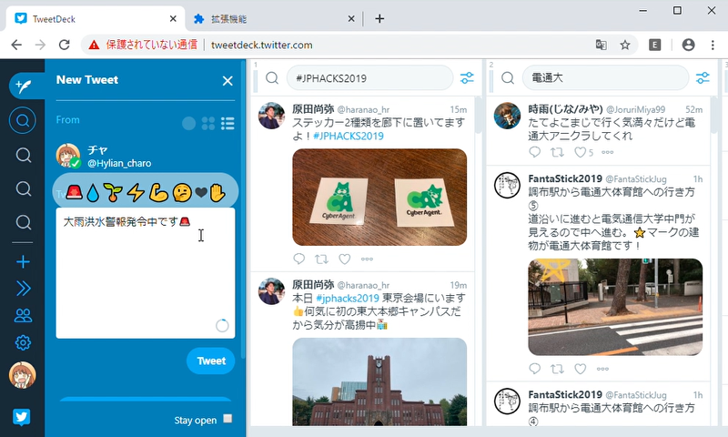
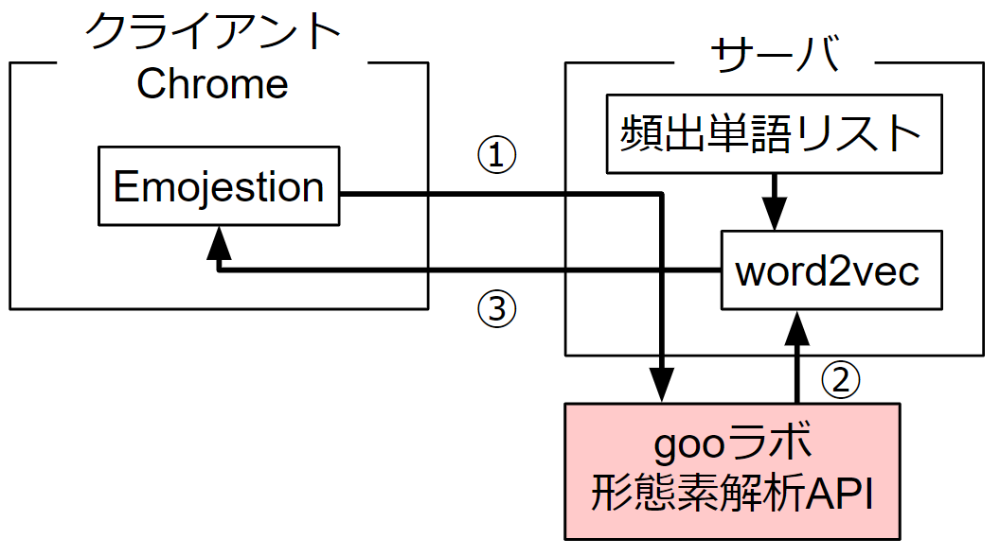

# Emojestion

## 製品概要
### Message Tech
### 背景（製品開発のきっかけ、課題等）
- メッセージを送る際、文章が硬くなってしまったり、同じ絵文字を使ってしまったり、どんな絵文字を使って良いのか分からなかったりする時があります。そのような悩みを解決するためにこのGoogle拡張機能を作りました。
- 仕事場などでメッセージをよく送っている方、コミュニケーションが苦手な方、ツイ廃🐦

### 製品説明（具体的な製品の説明）
#### 概要図

### 特長

#### 1. AIによる絵文字の推奨
　入力中のメッセージの意味を分析し、似た意味の単語とよく一緒に使われる絵文字を提案します💡
#### 2. 心情表現の手助け
　メッセージに適切な絵文字を使うことで、相手に自分の心情を分かりやすく伝えらます❤️
#### 3. スムーズな絵文字の入力
　ワンクリックで簡単に絵文字を表示させることが出来ます👆
### 解決出来ること
メッセージにおけるスムーズで豊かなコミュニケーションを行うことが可能になります。
更にパソコンでは変換しにくい絵文字のスムーズな入力を可能とします。

### 今後の展望
絵文字が8種類しかないので、絵文字の種類を増やしていくことです。また、tweetdeckでしか対応していないので、slackなどにも対応していくことです。

## 開発内容・開発技術

### 活用した技術
#### API・データ
* 形態素解析API
* 日本語word2vecモデル(http://aial.shiroyagi.co.jp/2017/02/japanese-word2vec-model-builder/)

#### フレームワーク・ライブラリ・モジュール
* word2vec
* Janome

#### デバイス
* 特に無し

### 研究内容・事前開発プロダクト（任意）
* 特に無し

### 独自開発技術（Hack Dayで開発したもの）
#### 2日間に開発した独自の機能・技術
* chrome拡張機能、推奨欄の出現
* Tweetデータセットから、特定の絵文字とよく使われる単語の抽出と、意味の類似度による最適な絵文字の提案AI。

